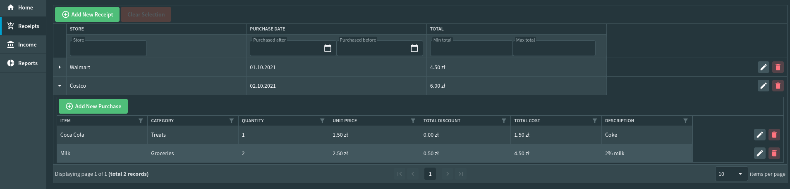
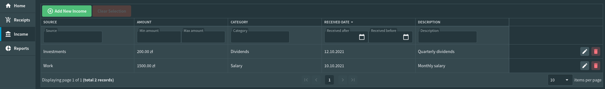

<p align="center">
    
</p>

## Expense-Explorer

[](https://100commitow.pl/)
[](https://github.com/Frognar/Expense-Explorer/actions/workflows/dotnet.yml)
[](LICENSE)

Expense Explorer is a simple expense tracking application designed to run on a home server, allowing users to manage their receipts and track expenses conveniently. This project is written in C# and serves as a learning opportunity, particularly for exploring concepts like Event Sourcing.

## Features

- [x] **Receipt Management:** Add, edit, and delete receipts.
- [x] **Purchase Management:** Add, edit, and delete purchases associated with receipts.
- [X] **Browse Receipts:** View and search through receipts based on store, date, and total amount.
- [x] **Browse Stores, Items, and Categories:** View and search through stores, items, and categories used in receipts and purchases.
- [x] **Reporting:** Generate category-wise expense reports for a given date range.


## Nice to Have

- [ ] **GUI:** A simple web-based GUI to interact with the application.
- - [x] ***Income Page***
- - [x] ***Expense Page***
- - [ ] ***Reports Page***
- [ ] **OCR Integration:** Automatically extract receipt details using OCR.
- [x] **Income Tracking:** Track income and compare with expenses.

## Note

- This application is intended for personal use and is not designed for multi-user environments. Receipts are not associated with specific users.
- The primary purpose of this project is to explore and learn new technologies, specifically Event Sourcing.
- Future development may include additional features.

I recognize that using ready-made solutions (e.g., MediatR for handling requests) might be more efficient, but I also wanted to use this project to expand my knowledge of how such libraries work. It is possible that in the future, I will replace my own implementations with better, more tested packages.

## Getting Started
The project is currently under development. Stay tuned for future updates on setup and usage instructions.
The API is already implemented and can be used; [documentation](#API) is available below.

1. **Clone the Repository:** Begin by cloning the Expense Explorer repository to your local machine:
    ```bash
    git clone https://github.com/Frognar/Expense-Explorer.git
    ```
2. **Set Up Environment:** Ensure you have the necessary environment set up to run the project.
    - [.NET SDK ](https://dotnet.microsoft.com/download)
    - [Docker Desktop](https://www.docker.com/products/docker-desktop/).

3. **Build and Run:** Navigate to the solution directory and run *build.sh* script to build the project:
    ```bash
    ./build.sh
    ```

   Once the build process is complete, you can execute *run.sh* script to start the application:
    ```bash
    ./run.sh
    ```

   The API should now be running and accessible at `http://localhost:5163`.
4. **Explore API Endpoints:** With the application running, you can explore the API endpoints provided. For example, you
   can interact with the receipt endpoints by sending HTTP requests to `/api/receipts`. You can use tools like Postman
   or curl to make requests.

## Technology Stack

Expense Explorer is built on a modern and robust technology stack:

- **.NET 8:** The latest version of the .NET framework provides a high-performance runtime and a rich set of APIs for building modern applications.
- **C# 12:** The latest C# version, offering enhanced language features and improved productivity.
- **EventStore:** A purpose-built database for storing events, enabling a reliable and scalable event-sourcing architecture.
- **PostgreSQL:** A powerful and open-source relational database used for storing projections and executing queries.
- **.NET Blazor:** This framework enables the development of rich web applications with C# instead of JavaScript, resulting in a seamless user experience.
- **Radzen:** This component library for Blazor accelerates the development process by offering pre-built components like data grids, forms, charts, and more.
- **Clean Architecture:** Expense Explorer adheres to the principles of Clean Architecture, promoting maintainability, testability, and flexibility.
- **CQRS (Command Query Responsibility Segregation):** This architectural pattern separates read and write operations, leading to improved scalability and performance.


### Commands
The command side of Expense Explorer heavily leverages functional programming concepts:

- **Monads:** Monads like Maybe (for nullable values) and Result (for error handling) are used extensively to model computations and manage side effects.
- **Query Syntax:** C#'s query syntax is employed to compose monadic operations in a declarative and readable style.


#### Example:

```csharp
public async Task<Result<Receipt>> HandleAsync(
    UpdatePurchaseDetailsCommand command,
    CancellationToken cancellationToken = default)
{
    ArgumentNullException.ThrowIfNull(command);
    return await (
        from patchModel in UpdatePurchaseDetailsValidator.Validate(command)
        from receiptId in Id.TryCreate(command.ReceiptId).ToResult(() => CommonFailures.InvalidReceiptId)
        from receipt in _receiptRepository.GetAsync(receiptId, cancellationToken)
        from purchaseId in Id.TryCreate(command.PurchaseId).ToResult(() => CommonFailures.InvalidPurchaseId)
        from purchase in TryGetPurchase(receipt, purchaseId)
        let receiptWithUpdatedPurchase = receipt.UpdatePurchaseDetails(Update(purchase, patchModel))
        from version in _receiptRepository.SaveAsync(receiptWithUpdatedPurchase, cancellationToken)
        select receiptWithUpdatedPurchase.WithVersion(version).ClearChanges());
}
```
In this example, ```Id.TryCreate``` returns a ```Maybe<Id>```, which is then converted to a ```Result<Id>``` using ```ToResult(Func<Failure> onNoneFailureFactory)``` extension method. This allows for elegant error handling and concise code composition.

## API Documentation
#### Documentation is available [here](API.md)

## GUI
<b>NOTE:</b> The ExpenseExplorer GUI is currently under active development.

#### Receipts page

#### Income page


## Contributing

Contributions to Expense Explorer are welcome! Whether it's bug fixes, new features, or enhancements, feel free to submit pull requests.

## License

This project is licensed under the [MIT License](LICENSE). Feel free to use, modify, and distribute as per the terms of the license.
