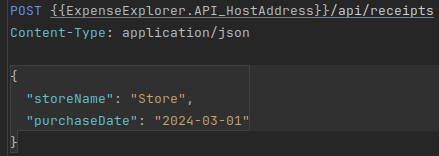
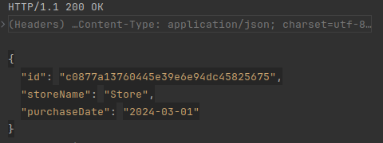

<p align="center">
    
</p>

## Expense-Explorer

[](https://100commitow.pl/)
[](https://github.com/Frognar/Expense-Explorer/actions/workflows/dotnet.yml)
[](LICENSE)

Expense Explorer is a simple expense tracking application designed to run on a home server, allowing users to manage their receipts and track expenses conveniently. This project is written in C# and serves as a learning opportunity, particularly exploring concepts like Event-sourcing.

## Features

- **Add Receipts:** Users can easily add receipts along with all items.
- **Edit Receipts:** Receipts can be edited to update details or add/remove items.
- **Category Assignment:** Items can be assigned to specific categories during entry into the system by users.
- **Browse Receipts:** Users can browse through saved receipts effortlessly.
- **Expense Reports:** Generate reports to visualize total spending and spending by category within any given time range.

## Nice to Have

- **GUI:** A simple web-based GUI to interact with the application.
- **OCR Integration:** Automatically extract receipt details using OCR.
- **Income Tracking:** Track income and compare with expenses.

## Note

- This application is intended for personal use and is not designed for multi-user environments. Receipts are not associated with specific users.
- The primary purpose of this project is to explore and learn new technologies, specifically Event Sourcing in this case.
- Future development may include additional features.


## Getting Started

The project is currently under development. Stay tuned for future updates on setup and usage instructions.

1. **Clone the Repository:** Begin by cloning the Expense Explorer repository to your local machine:
    ```bash
    git clone https://github.com/Frognar/Expense-Explorer.git
    ```
2. **Set Up Environment:** Ensure you have the necessary environment set up to run the project.
    - [.NET SDK ](https://dotnet.microsoft.com/download)
    - [Docker Desktop](https://www.docker.com/products/docker-desktop/).

3. **Build and Run:** Navigate to the solution directory and run *build.sh* script to build the project:
    ```bash
    ./build.sh
    ```

   Once the build process is complete, you can execute *run.sh* script to start the application:
    ```bash
    ./run.sh
    ```

   The application should now be running and accessible at `http://localhost:5000`.
4. **Explore API Endpoints:** With the application running, you can explore the API endpoints provided. For example, you
   can interact with the receipt endpoints by sending HTTP requests to `/api/receipts`. You can use tools like Postman
   or curl to make requests.

Request:
> 

Response:
> 

## Contributing

Contributions to Expense Explorer are welcome! Whether it's bug fixes, new features, or enhancements, feel free to submit pull requests.

## License

This project is licensed under the [MIT License](LICENSE). Feel free to use, modify, and distribute as per the terms of the license.
